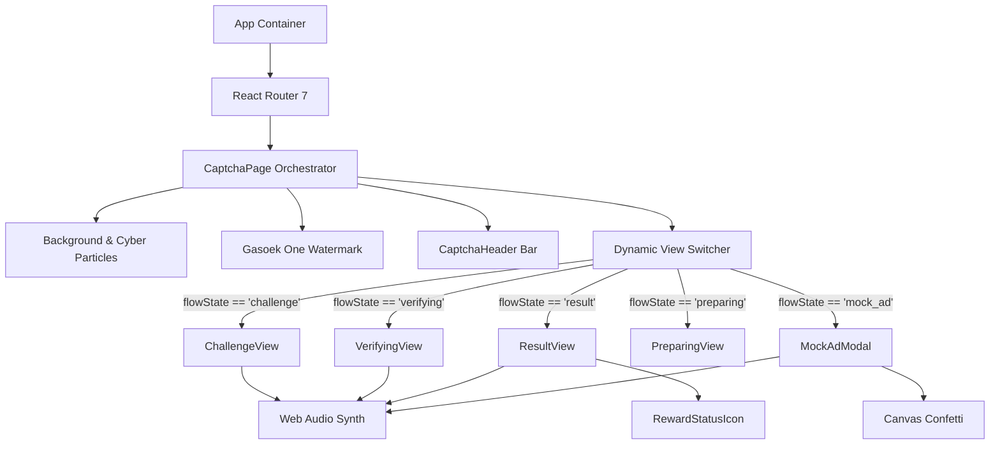

# System Architecture & State Machine

This document details the architectural foundation, finite state machine, component hierarchy, data flow, and performance model powering the **VELoop Rewards CAPTCHA Earn Module**.

---

## 🏗️ Architectural Overview

The application follows a **modular, unidirectional component-based architecture**. The entire verification experience is encapsulated within the `<CaptchaPage />` root component, which acts as a stateful orchestrator governing stateless and presentation-driven view components.



---

## 🔄 Finite State Machine (FSM)

The user journey is modeled as a deterministic Finite State Machine with five primary states:

```
┌─────────────────────────────────────────────────────────────────────────────────┐
│                                                                                 │
│                                 [ challenge ]                                   │
│                                       │                                         │
│                                       │ User clicks option                      │
│                                       ▼                                         │
│                                 [ verifying ]                                   │
│                                       │                                         │
│                                       │ 0.5s transition + 0.75s orbital check   │
│                                       ▼                                         │
│                                  [ result ]                                     │
│                                       │                                         │
│                     ┌─────────────────┴─────────────────┐                       │
│                     │ User clicks 'Claim'               │ User clicks           │
│                     │                                   │ 'No Thanks'           │
│                     ▼                                   ▼                       │
│               [ preparing ]                      (Reset & Loop)                 │
│                     │                                   │                       │
│                     │ 1.1s progress timer               │                       │
│                     ▼                                   │                       │
│                [ mock_ad ]                              │                       │
│                     │                                   │                       │
│       ┌─────────────┴─────────────┐                     │                       │
│       │ User claims reward        │ User skips ad       │                       │
│       ▼                           ▼                     │                       │
│   (Gems updated + Loop)       (Loop)                    │                       │
│       │                           │                     │                       │
│       └───────────────────────────┴─────────────────────┴───────────────────────┘
```

### Detailed State Transitions

| State | Entry Trigger | Active Components | Exit Condition | Next State |
| :--- | :--- | :--- | :--- | :--- |
| **`challenge`** | Page load or loop reset | `<ChallengeView />` | User selects an option (click or key `1-4`) | `verifying` |
| **`verifying`** | Option selection | `<VerifyingView />` | Internal timer completes (~1250ms total: 500ms verifying + 750ms checking) | `result` |
| **`result`** | Verification resolution | `<ResultView />`, `<RewardStatusIcon />` | **Branch A**: User clicks **Claim**<br>**Branch B**: User clicks **No Thanks** | **Branch A**: `preparing`<br>**Branch B**: `challenge` (fresh code) |
| **`preparing`** | Result claim clicked | `<PreparingView />` | Progress bar reaches 100% (1100ms) | `mock_ad` |
| **`mock_ad`** | Preparation completed | `<MockAdModal />` | **Action A**: User clicks **Collect Reward**<br>**Action B**: User clicks **Skip** | `challenge` (gems incremented if claimed, fresh code generated) |

---

## 🔒 Single-Use Anti-Reuse Invariant

In compliance with the project specifications, **a challenge is never reused**. When exiting either the **No Thanks** path or the **Claim** path:

1. **State Invalidation**: `selectedOption` is reset to `null`.
2. **Fresh Challenge Generation**: `generateCaptchaChallenge()` creates a new random 6-character code and fresh distractors.
3. **Key Re-Mounting Strategy**:
   ```jsx
   <ChallengeView
     key={challenge?.code || "initial"}
     challenge={challenge}
     onSelect={handleSelectOption}
     onRefresh={handleRefreshChallenge}
   />
   ```
   By binding React's `key` attribute directly to `challenge.code`, React automatically destroys the previous instance and cleanly re-mounts a pristine component tree. This eliminates residual CSS animations, card tilt coordinates, and scramble intervals.

---

## 🔁 Data Flow & State Hierarchy

All critical state flows unidirectionally from `<CaptchaPage />` down to child views via props:

```
CaptchaPage (State Holder)
 ├── gems: number (Default: 125.50)
 ├── flowState: 'challenge' | 'verifying' | 'result' | 'preparing' | 'mock_ad'
 ├── challenge: { code: string, options: string[] }
 ├── selectedOption: string | null
 └── isSuccess: boolean
```

Child components communicate state changes exclusively by bubbling events back up via callback props:

- `onSelect(option)`: Triggers transition to `verifying` with the chosen string.
- `onComplete()`: Signals that the verification timer elapsed; resolves whether `selectedOption === challenge.code`.
- `onClaim()`: Advances the workflow to `preparing`.
- `onNoThanks()`: Bypasses the ad, regenerates challenge, and loops to `challenge`.
- `onReady()`: Signals preparation complete; launches `mock_ad`.
- `onClaimReward()`: Calculates reward earnings (+1.00 Gem for success, +0.50 Gem for wrong attempt), increments `gems`, triggers confetti, and loops back.
- `onSkip()`: Discards reward and loops back with a fresh challenge.

---

## ⚡ Performance & Rendering Architecture

The application is engineered to maintain a constant **60 FPS / 120 FPS** refresh rate, even with active 3D transforms, particle animations, and ambient glow effects:

### 1. RequestAnimationFrame Spotlight Throttling
The mouse-following ambient cursor spotlight utilizes `requestAnimationFrame` to batch DOM updates with the browser's display refresh cycle:
```javascript
let rafId;
const handleMouseMove = (e) => {
  if (!cursorGlowRef.current) return;
  cancelAnimationFrame(rafId);
  rafId = requestAnimationFrame(() => {
    cursorGlowRef.current.style.transform = 
      `translate3d(${e.clientX - 250}px, ${e.clientY - 250}px, 0)`;
  });
};
```

### 2. Hardware-Accelerated 3D Transforms
The interactive tilt effect on `<ChallengeView />` modifies 3D perspective rotation using CSS custom properties and `rotateX`/`rotateY`:
- Calculations run directly against element bounding rectangles.
- GPU compositing is activated with `will-change: transform`.
- No forced layout recalculations or layout thrashing occur.

### 3. Pure Scoped CSS Modules
Styles are segregated into `*.module.css` files, producing scoped hashed class names (e.g., `ChallengeView_captchaCard__a8d9f`). This guarantees:
- Zero global CSS selector collision.
- Extremely low style recalculation overhead.
- No bulky runtime CSS-in-JS libraries (such as Emotion or styled-components).
